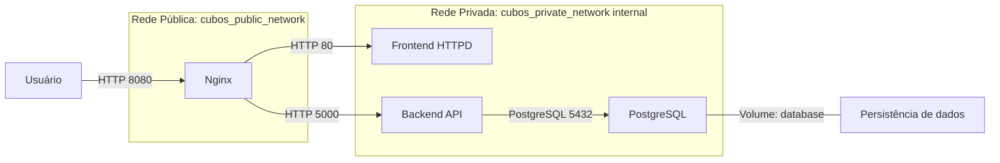

# cubos-devops-test

Este projeto é parte de um desafio técnico e tem como objetivo demonstrar
a criação de uma infraestrutura como código utilizando Terraform e Docker.  
A arquitetura implementada garante isolamento, segurança e persistência de dados
em uma aplicação composta por **Frontend, Backend, Banco de Dados e Proxy Reverso**.

## Requisitos

- [Docker](https://docs.docker.com/get-docker/) (necessário para criação e execução dos containers)
- [Terraform](https://developer.hashicorp.com/terraform/downloads) (necessário para provisionar a infraestrutura como código)

## Infraestrutura do Projeto

A infraestrutura consiste em 4 containers:
- Frontend: Container apache servindo a aplicação frontend
- Backend: Container node servindo uma API que fornece dados para o frontend
- PostgreSQL: Container postgres com volume docker persistente e mapeamento de porta para o localhost(127.0.0.1), garantindo que somente a máquina local consiga acessar
- Nginx: Container nginx atuando como proxy reverso
### Redes
- cubos_public_network: Rede pública, conecta apenas o nginx(ponto de entrada da aplicação)
- cubos_private_network: Rede interna, conecta todos os containers isolando do acesso externo

### Fluxo de Comunicação
- Usuário → solicita / → Nginx → Frontend.
- Frontend → requisita /api → Nginx → Backend.
- Backend → consulta → PostgreSQL.

Apenas o Nginx está exposto para o mundo externo; frontend, backend e banco ficam isolados na rede privada.

### Persistência dos Dados
Os dados do banco de dados são armazenados dentro de um volume docker chamado `database`. isso garante que, mesmo apagando o container, os dados permanecem

## Inicialização da Infraestrutura Local
### Preparar variáveis
Na raiz do projeto crie um arquivo `terraform.tfvars` ou `qualqueroutronome.auto.tfvars` e adicione as seguintes variáveis:
```hcl
postgres_user     = "ususario_do_postgres"
postgres_password = "senha_do_usuario_do_postgres"
```
Dentro da pasta backend crie um arquivo `.env` e adicione as seguintes variáveis:
```env
DATABASE_USER="ususario_do_postgres"
DATABASE_PASSWORD="senha_do_usuario_do_postgres"
DATABASE_URL="postgres"
DATABASE_PORT="5432"
port="5000"
```
> Atenção: O mesmo usuário e senha que for definido no arquivo `.tfvars` deve ser o mesmo do `.env`

### Inicializar o Terraform
Na raiz do projeto
```bash
terraform init
```
### Criar Infraestrutura
```bash
terraform apply
ou
terraform apply -auto-approve
```
Caso utilize o comando sem o parâmetro `-auto-approve`, confirme a criação da infraestrutura digitando `yes`

### Comandos Úteis
- Listar containers
```bash
docker ps
```
- Ver logs dos containers
```bash
docker logs -f [nome_do_container]
```
- Destruir Infraestrutura
```bash
terraform destroy
ou
terraform destroy -auto-approve
```
